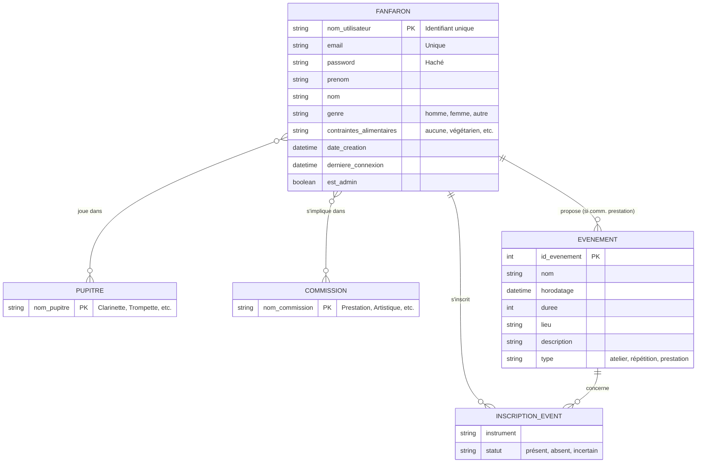
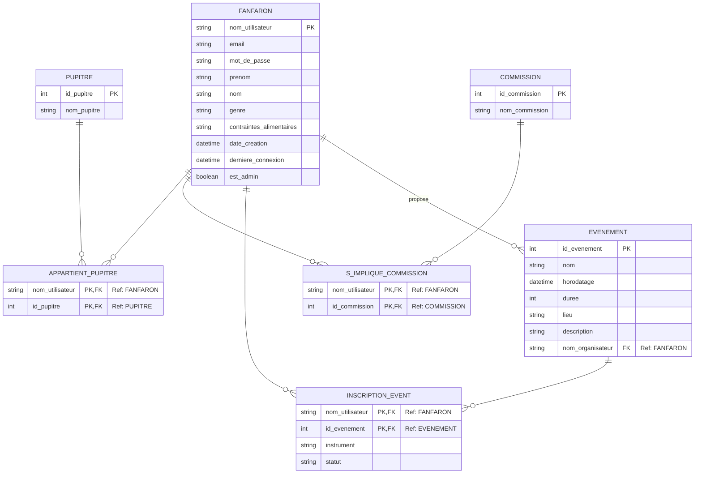

# projet_info_reparti

## Exercice 1 : Inscription

### Q1. 

### MCD (Modèle Conceptuel des Données)



### MLD



<b>FANFARON</b> (<u>nom_utilisateur</u>, email, mot_de_passe, prenom, nom, genre, contraintes_alimentaires, date_creation, derniere_connexion, est_admin)

#### Contraintes d'intégrité :

<b>Clé Primaire</b> : nom_utilisateur.  
<b>Unicité</b> : email doit être unique.  
<b>Obligation (NOT NULL)</b> : nom_utilisateur, email, mot_de_passe, prenom, nom, date_creation, est_admin sont obligatoires pour l'inscription.  
<b>Domaine</b> :  
genre $\in$ {« homme », « femme », « autre »}.  
contraintes_alimentaires $\in$ {« aucune », « végétarien », « vegan », « sans porc »}.  
<b>Sécurité</b> : mot_de_passe doit être stocké sous forme hachée

### Création de la table SQL

```sql
CREATE DATABASE fanfarehub_db;

CREATE USER fanfare_hub_owner WITH PASSWORD '...';

GRANT ALL PRIVILEGES ON DATABASE fanfarehub_db TO fanfare_hub_owner;

ALTER DATABASE fanfarehub_db OWNER TO fanfare_hub_owner;

CREATE TABLE FANFARON (
    nom_utilisateur VARCHAR(255) PRIMARY KEY,
    email VARCHAR(255) UNIQUE NOT NULL,
    mot_de_passe VARCHAR(255) NOT NULL,
    prenom VARCHAR(255) NOT NULL,
    nom VARCHAR(255) NOT NULL,
    genre VARCHAR(20) CHECK (genre IN ('homme', 'femme', 'autre')),
    contraintes_alimentaires VARCHAR(50) CHECK (contraintes_alimentaires IN ('aucune', 'végétarien', 'vegan', 'sans porc')),
    date_creation TIMESTAMP NOT NULL DEFAULT CURRENT_TIMESTAMP,
    derniere_connexion TIMESTAMP,
    est_admin BOOLEAN NOT NULL DEFAULT FALSE
);

ALTER TABLE FANFARON OWNER TO fanfare_hub_owner;
```