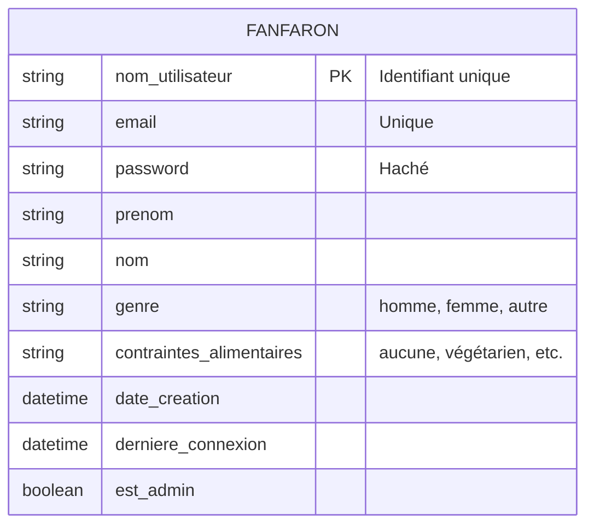

# projet_info_reparti

## Exercice 1 : Inscription

### Q1. MCD (Modèle Conceptuel des Données)

```mermaid
erDiagram
    FANFARON {
        string nom_utilisateur PK "Identifiant unique"
        string email "Unique"
        string password "Haché"
        string prenom
        string nom
        string genre "homme, femme, autre"
        string contraintes_alimentaires "aucune, végétarien, etc."
        datetime date_creation
        datetime derniere_connexion
        boolean est_admin
    }
```