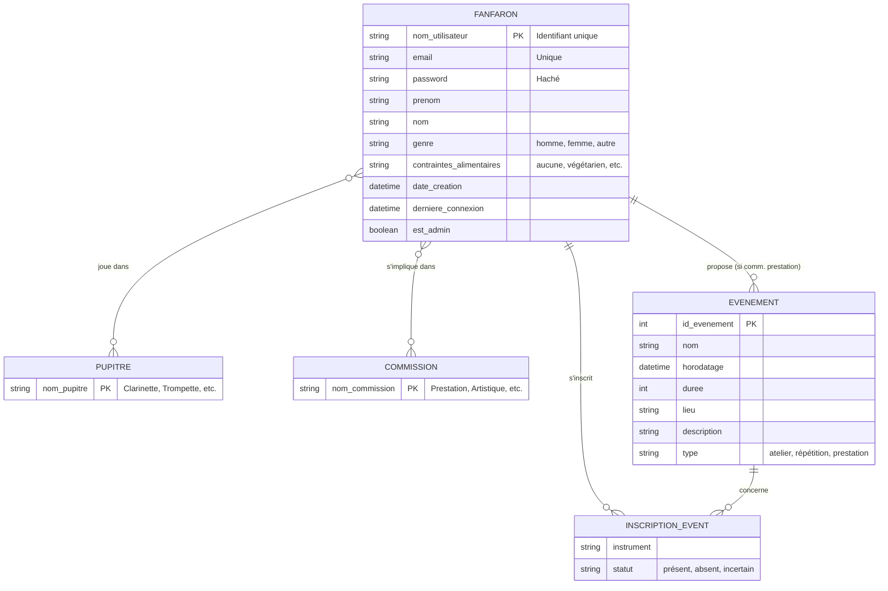
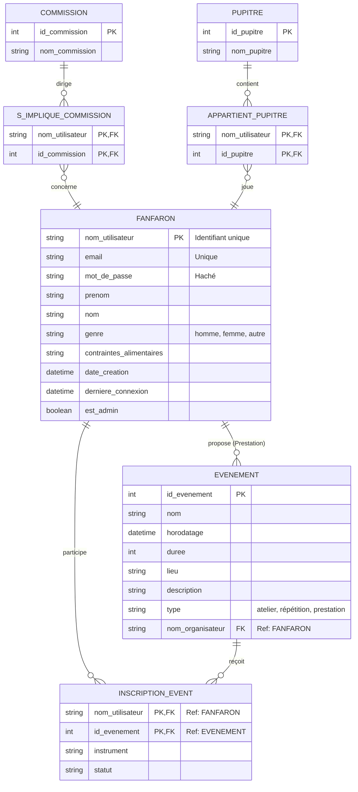

# Projet Info Réparti

Tanguy LASNE
Housni RAKOTOARISOA


### MCD (Modèle Conceptuel des Données)


```mermaid
erDiagram
    FANFARON {
        string nom_utilisateur PK "Identifiant unique"
        string email "Unique"
        string password "Haché"
        string prenom
        string nom
        string genre "homme, femme, autre"
        string contraintes_alimentaires "aucune, végétarien, etc."
        datetime date_creation
        datetime derniere_connexion
        boolean est_admin
    }

    PUPITRE {
        string nom_pupitre PK "Clarinette, Trompette, etc."
    }

    COMMISSION {
        string nom_commission PK "Prestation, Artistique, etc."
    }

    EVENEMENT {
        int id_evenement PK
        string nom
        datetime horodatage
        int duree
        string lieu
        string description
        string type "atelier, répétition, prestation"
    }

    INSCRIPTION_EVENT {
        string instrument
        string statut "présent, absent, incertain"
    }

    FANFARON }o--o{ PUPITRE : "joue dans"
    FANFARON }o--o{ COMMISSION : "s'implique dans"
    FANFARON ||--o{ INSCRIPTION_EVENT : "s'inscrit"
    EVENEMENT ||--o{ INSCRIPTION_EVENT : "concerne"
    FANFARON ||--o{ EVENEMENT : "propose (si comm. prestation)"
```

### MLD


```mermaid
    erDiagram
    COMMISSION ||--o{ S_IMPLIQUE_COMMISSION : "dirige"
    PUPITRE ||--o{ APPARTIENT_PUPITRE : "contient"

    S_IMPLIQUE_COMMISSION }o--|| FANFARON : "concerne"
    APPARTIENT_PUPITRE }o--|| FANFARON : "joue"

    FANFARON {
        string nom_utilisateur PK "Identifiant unique"
        string email "Unique"
        string mot_de_passe "Haché"
        string prenom
        string nom
        string genre "homme, femme, autre"
        string contraintes_alimentaires
        datetime date_creation
        datetime derniere_connexion
        boolean est_admin
    }

    FANFARON ||--o{ EVENEMENT : "propose (Prestation) "
    FANFARON ||--o{ INSCRIPTION_EVENT : "participe"
    EVENEMENT ||--o{ INSCRIPTION_EVENT : "reçoit"

    EVENEMENT {
        int id_evenement PK
        string nom
        datetime horodatage
        int duree
        string lieu
        string description
        string type "atelier, répétition, prestation"
        string nom_organisateur FK "Ref: FANFARON "
    }

    INSCRIPTION_EVENT {
        string nom_utilisateur PK, FK "Ref: FANFARON"
        int id_evenement PK, FK "Ref: EVENEMENT"
        string instrument
        string statut
    }

    COMMISSION {
        int id_commission PK
        string nom_commission ""
    }
    PUPITRE {
        int id_pupitre PK
        string nom_pupitre ""
    }
    APPARTIENT_PUPITRE {
        string nom_utilisateur PK, FK
        int id_pupitre PK, FK
    }
    S_IMPLIQUE_COMMISSION {
        string nom_utilisateur PK, FK
        int id_commission PK, FK
    }
```

<b>FANFARON</b> (<u>nom_utilisateur</u>, email, mot_de_passe, prenom, nom, genre, contraintes_alimentaires, date_creation, derniere_connexion, est_admin)

#### Contraintes d'intégrité :

<b>Clé Primaire</b> : nom_utilisateur.  
<b>Unicité</b> : email doit être unique.  
<b>Obligation (NOT NULL)</b> : nom_utilisateur, email, mot_de_passe, prenom, nom, date_creation, est_admin sont obligatoires pour l'inscription.  
<b>Domaine</b> :  
genre $\in$ {« homme », « femme », « autre »}.  
contraintes_alimentaires $\in$ {« aucune », « végétarien », « vegan », « sans porc »}.  
<b>Sécurité</b> : mot_de_passe doit être stocké sous forme hachée

# -------------------------------
### Création de la table SQL

```sql
CREATE DATABASE fanfarehub_db;

CREATE USER fanfare_user WITH PASSWORD 'motDePasse';
       
REVOKE ALL ON SCHEMA public FROM PUBLIC;

GRANT CONNECT ON DATABASE fanfarehub_db TO fanfare_user;
GRANT USAGE ON SCHEMA public TO fanfare_user;

DROP TABLE IF EXISTS inscription_event CASCADE;
DROP TABLE IF EXISTS evenement CASCADE;
DROP TABLE IF EXISTS s_implique_commission CASCADE;
DROP TABLE IF EXISTS appartient_pupitre CASCADE;
DROP TABLE IF EXISTS commission CASCADE;
DROP TABLE IF EXISTS pupitre CASCADE;
DROP TABLE IF EXISTS fanfaron CASCADE;

CREATE TABLE fanfaron (
                          nom_utilisateur VARCHAR(255) PRIMARY KEY, -- Identifiant unique de connexion
                          email VARCHAR(255) UNIQUE NOT NULL,
                          mot_de_passe VARCHAR(255) NOT NULL,
                          prenom VARCHAR(255) NOT NULL,
                          nom VARCHAR(255) NOT NULL,
                          genre VARCHAR(20) CHECK (genre IN ('homme', 'femme', 'autre')),
                          contraintes_alimentaires VARCHAR(50) CHECK (contraintes_alimentaires IN ('aucune', 'végétarien', 'vegan', 'sans porc')),
                          date_creation TIMESTAMP NOT NULL DEFAULT CURRENT_TIMESTAMP,
                          derniere_connexion TIMESTAMP,
                          est_admin BOOLEAN NOT NULL DEFAULT FALSE
);

CREATE TABLE pupitre (
                         id_pupitre SERIAL PRIMARY KEY,
                         nom_pupitre VARCHAR(100) UNIQUE NOT NULL
);

CREATE TABLE commission (
                            id_commission SERIAL PRIMARY KEY,
                            nom_commission VARCHAR(100) UNIQUE NOT NULL
);

CREATE TABLE appartient_pupitre (
                                    nom_utilisateur VARCHAR(255) REFERENCES fanfaron(nom_utilisateur) ON DELETE CASCADE,
                                    id_pupitre INT REFERENCES pupitre(id_pupitre) ON DELETE CASCADE,
                                    PRIMARY KEY (nom_utilisateur, id_pupitre)
);

CREATE TABLE s_implique_commission (
                                       nom_utilisateur VARCHAR(255) REFERENCES fanfaron(nom_utilisateur) ON DELETE CASCADE,
                                       id_commission INT REFERENCES commission(id_commission) ON DELETE CASCADE,
                                       PRIMARY KEY (nom_utilisateur, id_commission)
);

CREATE TABLE evenement (
                           id_evenement SERIAL PRIMARY KEY,
                           nom VARCHAR(255) NOT NULL,
                           horodatage TIMESTAMP NOT NULL,
                           duree INT NOT NULL,
                           lieu VARCHAR(255) NOT NULL,
                           description TEXT,
                           type VARCHAR(50) CHECK (type IN ('atelier', 'répétition', 'prestation')),
                           nom_organisateur VARCHAR(255) REFERENCES fanfaron(nom_utilisateur) ON DELETE SET NULL
);

CREATE TABLE inscription_event (
                                   nom_utilisateur VARCHAR(255) REFERENCES fanfaron(nom_utilisateur) ON DELETE CASCADE,
                                   id_evenement INT REFERENCES evenement(id_evenement) ON DELETE CASCADE,
                                   instrument VARCHAR(100),
                                   statut VARCHAR(20) CHECK (statut IN ('présent', 'absent', 'incertain')),
                                   PRIMARY KEY (nom_utilisateur, id_evenement)
);

INSERT INTO pupitre (nom_pupitre) VALUES
                                      ('clarinette'), ('saxophone alto'), ('euphonium'), ('percussion'),
                                      ('basse'), ('trompette'), ('saxophone baryton'), ('trombone');

INSERT INTO commission (nom_commission) VALUES
                                            ('commission prestation'), ('commission artistique'),
                                            ('commission logistique'), ('commission communication interne');

GRANT SELECT, INSERT, UPDATE, DELETE ON TABLE
    fanfaron, pupitre, commission, appartient_pupitre,
    s_implique_commission, evenement, inscription_event
    TO fanfare_user;

GRANT USAGE, SELECT, UPDATE ON SEQUENCE
    pupitre_id_pupitre_seq,
    commission_id_commission_seq,
    evenement_id_evenement_seq
    TO fanfare_user;

GRANT SELECT, INSERT, UPDATE, DELETE ON TABLE fanfaron TO fanfare_user;


-- ==========================================
-- DONNÉES DE TEST
-- ==========================================

-- Ajout des Fanfarons
INSERT INTO fanfaron (nom_utilisateur, email, mot_de_passe, prenom, nom, genre, contraintes_alimentaires, est_admin)
VALUES
    ('admin', 'admin@fanfarehub.fr', '8c6976e5b5410415bde908bd4dee15dfb167a9c873fc4bb8a81f6f2ab448a918', 'Super', 'Admin', 'autre', 'aucune', TRUE),
    ('jdupont', 'jean.dupont@email.com', '6a715a519890f91bf971f11fcb68072124506fbc3b53c65cdeff8e7b9ec598f8', 'Jean', 'Dupont', 'homme', 'végétarien', FALSE),
    ('mmartin', 'marie.martin@email.com', '6a715a519890f91bf971f11fcb68072124506fbc3b53c65cdeff8e7b9ec598f8', 'Marie', 'Martin', 'femme', 'aucune', FALSE),
    ('lpetit', 'lucas.petit@email.com', '6a715a519890f91bf971f11fcb68072124506fbc3b53c65cdeff8e7b9ec598f8', 'Lucas', 'Petit', 'homme', 'sans porc', FALSE);

-- Association des Fanfarons à leurs Pupitres
INSERT INTO appartient_pupitre (nom_utilisateur, id_pupitre)
VALUES
    ('admin', 6),
    ('jdupont', 1),
    ('mmartin', 4),
    ('lpetit', 8);

-- Implication des Fanfarons dans les Commissions
INSERT INTO s_implique_commission (nom_utilisateur, id_commission)
VALUES
    ('admin', 1),
    ('jdupont', 2),
    ('mmartin', 3);

-- Création d'Événements
INSERT INTO evenement (nom, horodatage, duree, lieu, description, type, nom_organisateur)
VALUES
    ('Répétition Générale', '2024-06-15 14:00:00', 120, 'Local de la fanfare', 'Répétition pour préparer la fête de la musique.', 'répétition', 'admin'),
    ('Fête de la Musique', '2024-06-21 20:00:00', 180, 'Place de la Mairie', 'Grande prestation annuelle en centre-ville.', 'prestation', 'admin'),
    ('Atelier d''improvisation', '2024-07-02 18:30:00', 90, 'Salle polyvalente', 'Atelier mené par un intervenant extérieur.', 'atelier', 'admin');

-- Inscription des Fanfarons aux Événements
INSERT INTO inscription_event (nom_utilisateur, id_evenement, instrument, statut)
VALUES
('admin', 1, 'trompette', 'présent'),
('jdupont', 1, 'clarinette', 'présent'),
('mmartin', 1, 'percussion', 'absent'),

('admin', 2, 'trompette', 'présent'),
('jdupont', 2, 'clarinette', 'présent'),
('mmartin', 2, 'percussion', 'présent'),
('lpetit', 2, 'trombone', 'incertain');
```